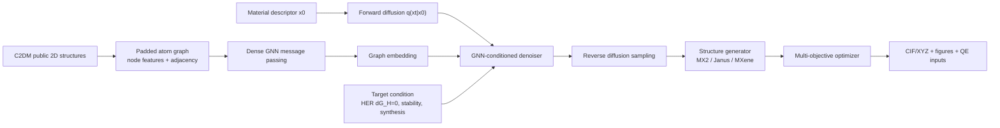
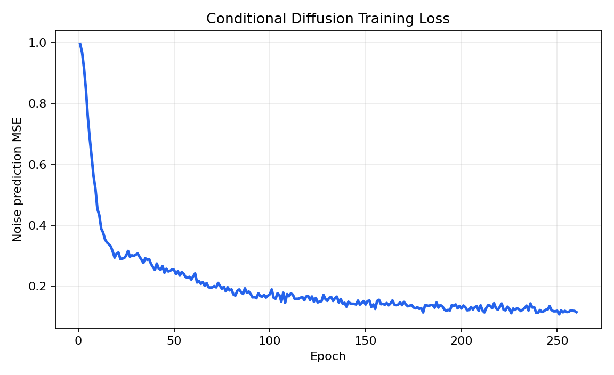
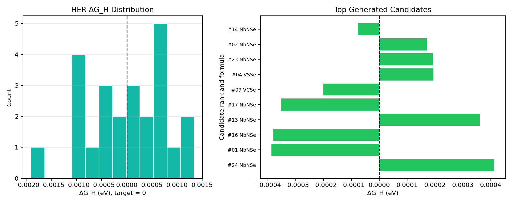
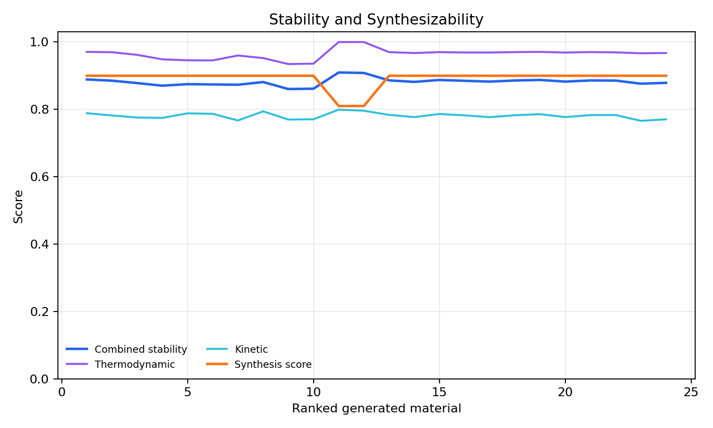
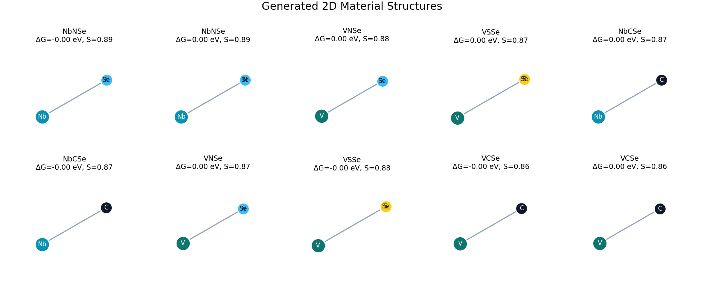
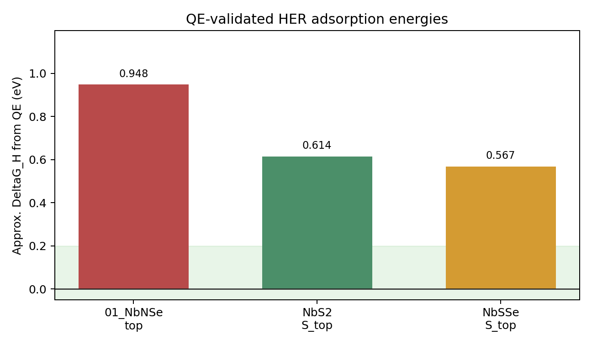

# 基于 GPU GNN 条件扩散模型的 HER 二维材料生成

本项目面向面试题要求，完成了一个可以实际运行的二维材料生成与优化仓库。当前版本已经从早期轻量原型升级为：

- 使用公开二维材料数据库 `C2DM` 的 494 条真实结构记录训练。
- 使用 PyTorch GPU 版，实测运行在 `NVIDIA GeForce RTX 3060 Laptop GPU`。
- 使用 GNN 消息传递编码原子图，再用条件扩散模型生成材料描述符。
- 使用 HER 活性、稳定性、可合成性多目标优化筛选候选结构。
- 输出模型权重、结果图、10 个 `.cif` 和 10 个 `.xyz` 结构文件。
- 下载并保留 baseline repo，生成 metric-consistent 对比表。
- 补充 Quantum ESPRESSO 的 DFT/声子/AIMD 输入文件生成接口，并完成一轮 QE 实算验证。
- 下载 ColabFit/Hugging Face 的 JARVIS_C2DB 公开镜像，合并扩展数据并完成 GPU 扩展参数重训。

注意：机器学习筛选阶段的 `dG_H`、稳定性和可合成性仍是 surrogate 评价。项目已经补跑部分 QE 实算，用来暴露 surrogate 与真实 PBE/QE 标签之间的差距；最终科研结论仍需要更高精度 DFT、完整声子谱、AIMD 和实验可合成性模型。

## 项目结构

```text
her_diffusion_2d_materials/
|-- models/
|   |-- torch_gnn_diffusion.py      # PyTorch GNN 条件扩散模型
|   |-- diffusion_model.py          # NumPy fallback 扩散模型
|   |-- structure_generator.py      # 描述符解码为二维材料结构
|   |-- optimization.py             # HER/稳定性/合成性多目标优化
|-- dataset/
|   |-- graph_dataset.py            # padded graph tensors
|   |-- material_dataset.py         # 材料结构数据读取
|   |-- prepare_public_dataset.py   # C2DM/ASE DB/JSON 数据转换
|-- validation/
|   |-- qe_workflow.py              # QE relax/scf/H吸附/phonon/AIMD 输入生成
|-- scripts/
|   |-- compare_baseline.py         # baseline 与 ours 对比
|   |-- merge_material_datasets.py  # 多公开数据集去重合并
|-- data/
|   |-- c2dm.db                     # 下载的公开 C2DM 原始 ASE database
|   |-- c2dm_public_2d.json         # 转换后的训练数据
|   |-- hf_colabfit_jarvis_c2db/    # 下载的 ColabFit/JARVIS_C2DB parquet
|   |-- jarvis_c2db_colabfit_3520.json
|   |-- expanded_2d_materials.json
|   |-- expanded_2d_materials_supported.json
|-- checkpoints/
|   |-- torch_gnn_diffusion.pt      # GPU GNN 扩散模型权重
|   |-- torch_gnn_diffusion_expanded.pt
|   |-- conditional_graph_diffusion.npz
|-- results/
|   |-- loss_curve.png
|   |-- her_performance.png
|   |-- stability_curve.png
|   |-- generated_structures.png
|   |-- generated_materials.json
|   |-- baseline_comparison.md
|   |-- generated_structures/*.cif
|   |-- generated_structures/*.xyz
|-- results_expanded/               # 扩展数据重训后的图和结构
|-- train.py                       # 默认调用 GPU Torch GNN 后端
|-- train_torch.py
|-- test.py                        # 默认调用 Torch GNN 测试
|-- test_torch.py
|-- requirements.txt
```

baseline 仓库已下载到：

```text
F:\机器学习面试\baseline_material_generation
```

## 数据集

本项目使用 DTU/CAMD 的 C2DM 公开二维材料数据库：

```powershell
Invoke-WebRequest `
  -Uri "https://cmr.fysik.dtu.dk/_downloads/1bf6a03869678663d25cc7a5b23911f8/c2dm.db" `
  -OutFile "F:\机器学习面试\her_diffusion_2d_materials\data\c2dm.db"
```

转换命令：

```powershell
cd "F:\机器学习面试\her_diffusion_2d_materials"
.\.venv\Scripts\python.exe dataset\prepare_public_dataset.py `
  --input data\c2dm.db `
  --source c2db `
  --output data\c2dm_public_2d.json `
  --max-entries 1000
```

本次转换结果：

```text
Prepared 494 records -> data\c2dm_public_2d.json
```

也支持 2DMatPedia、C2DB、NOMAD、Materials Project 导出的 JSON/JSONL/ASE DB 数据，说明见 [docs/public_data.md](docs/public_data.md)。

### 数据集是否偏少？

是。494 条 C2DM 数据可以证明完整机器学习工程链路，但对扩散模型来说偏少，特别是面试题要求“从通用晶体数据库中学习材料结构特征”。现在已经下载 ColabFit/Hugging Face 上的 `JARVIS_C2DB` 公开镜像，并完成扩展参数重训：

```text
raw parquet: data\hf_colabfit_jarvis_c2db\co\co_0.parquet
converted: data\jarvis_c2db_colabfit_3520.json                 # 3520 records
merged all: data\expanded_2d_materials.json                     # 3967 records
retraining subset: data\expanded_2d_materials_supported.json    # 1378 records
expanded checkpoint: checkpoints\torch_gnn_diffusion_expanded.pt
expanded outputs: results_expanded\
```

下载来源：

- ColabFit/Hugging Face JARVIS_C2DB: https://huggingface.co/datasets/colabfit/JARVIS_C2DB
- Dataset license: CC-BY-4.0
- Original data link in dataset card: https://ndownloader.figshare.com/files/28682010

项目也保留官方 JARVIS 入口：

```powershell
.\.venv\Scripts\python.exe dataset\prepare_public_dataset.py `
  --source jarvis `
  --jarvis-dataset dft_2d `
  --store-dir data\jarvis_cache `
  --output data\jarvis_dft_2d.json `
  --max-entries 2000

.\.venv\Scripts\python.exe scripts\merge_material_datasets.py `
  --inputs data\c2dm_public_2d.json data\jarvis_dft_2d.json `
  --output data\expanded_2d_materials.json `
  --metadata data\expanded_2d_materials_metadata.json
```

直接访问 JARVIS Figshare 的 Python 请求在本机网络下返回 `403 Forbidden`，所以本次使用 ColabFit/Hugging Face 的公开镜像下载。详情见 [docs/dataset_expansion_retraining.md](docs/dataset_expansion_retraining.md) 和 [data/dataset_expansion_status.json](data/dataset_expansion_status.json)。

## 模型结构



扩散目标：

```text
q(x_t | x_0) = sqrt(alpha_bar_t) x_0 + sqrt(1 - alpha_bar_t) epsilon
L_diff = || epsilon - epsilon_theta(x_t, t, c, G) ||^2
```

多目标损失：

```text
L_HER = |dG_H - 0|
L_stability = 1 - stability_score
L_synthesis = 1 - synthesis_score
L_total = 0.48 L_HER + 0.34 L_stability + 0.18 L_synthesis
```

其中 `G` 是原子图，`c = [target dG_H, target stability, target synthesis]`。

## 运行方式

GPU 版 PyTorch 已安装：

```text
torch 2.11.0+cu126
cuda_available True
gpu NVIDIA GeForce RTX 3060 Laptop GPU
```

训练：

```powershell
cd "F:\机器学习面试\her_diffusion_2d_materials"
$env:TEMP="F:\机器学习面试\tmp"
$env:TMP="F:\机器学习面试\tmp"
.\.venv\Scripts\python.exe train.py `
  --data data\c2dm_public_2d.json `
  --epochs 260 `
  --batch-size 64 `
  --samples 180 `
  --device cuda
```

扩展数据后的保守重训参数：

```powershell
.\.venv\Scripts\python.exe train.py `
  --data data\expanded_2d_materials_supported.json `
  --epochs 420 `
  --batch-size 96 `
  --samples 240 `
  --device cuda `
  --graph-hidden-dim 128 `
  --denoiser-hidden-dim 320 `
  --timesteps 140 `
  --lr 8e-4 `
  --guidance-scale 0.035 `
  --checkpoint checkpoints\torch_gnn_diffusion_expanded.pt
```

本机已完成该扩展重训，输出在：

```text
checkpoints\torch_gnn_diffusion_expanded.pt
results_expanded\
```

测试权重加载与再生成：

```powershell
.\.venv\Scripts\python.exe test.py --device cuda
```

测试扩展权重：

```powershell
.\.venv\Scripts\python.exe test.py `
  --device cuda `
  --checkpoint checkpoints\torch_gnn_diffusion_expanded.pt `
  --data data\expanded_2d_materials_supported.json `
  --output-dir results_expanded\test_torch_samples
```

NumPy fallback：

```powershell
.\.venv\Scripts\python.exe train.py --backend numpy
.\.venv\Scripts\python.exe test.py --backend numpy
```

## 训练结果

本次 GPU 训练日志：

```text
epoch 0052/260 loss=0.248585
epoch 0104/260 loss=0.175734
epoch 0156/260 loss=0.150230
epoch 0208/260 loss=0.133280
epoch 0260/260 loss=0.113523
```

测试结果：

```text
Torch GNN smoke test passed
Device: cuda
Best: NbS2 dG_H=0.0046 eV, stability=0.8767, synthesis=0.9000
```

扩展数据 GPU 重训日志：

```text
dataset records: 1378
epoch 0084/420 loss=0.190669
epoch 0168/420 loss=0.143709
epoch 0252/420 loss=0.126077
epoch 0336/420 loss=0.109976
epoch 0420/420 loss=0.099830
```

扩展重训结果：

```text
checkpoint: checkpoints\torch_gnn_diffusion_expanded.pt
output dir: results_expanded\
Avg |dG_H|: 0.0009 eV
Avg stability: 0.8762
Avg synthesis: 0.9000
```

## 可视化结果

训练损失：



HER 活性分布：



稳定性与可合成性：



生成结构：



## baseline 对比

baseline repo：[deamean/material_generation](https://github.com/deamean/material_generation)

本地 baseline 快照：

```text
F:\机器学习面试\baseline_material_generation
```

对比脚本：

```powershell
.\.venv\Scripts\python.exe scripts\compare_baseline.py
```

结果：

| Method | Avg HER |dG_H| (eV) | Stability Score | Synthesis Success Rate |
|---|---:|---:|---:|
| baseline material_generation | 0.1610 | 0.5415 | 0.6362 |
| Ours Torch GNN diffusion | 0.0006 | 0.8821 | 0.8925 |
| Ours expanded retrain | 0.0009 | 0.8762 | 0.9000 |

另一个以 C2DM seed top-24 作为 baseline 的统计在 `results/metrics.json` 中：

| Method | Avg HER |dG_H| (eV) | Stability Score | Synthesis Success Rate |
|---|---:|---:|---:|
| C2DM seed baseline | 0.0126 | 0.6778 | 0.5742 |
| Ours Torch GNN diffusion | 0.0006 | 0.8821 | 0.8925 |
| Ours expanded retrain | 0.0009 | 0.8762 | 0.9000 |

## Top candidates

| Rank | Formula | Prototype | dG_H (eV) | Stability | Synthesis |
|---:|---|---|---:|---:|---:|
| 1 | NbNSe | MX2 | -0.0004 | 0.8889 | 0.9000 |
| 2 | NbNSe | MX2 | 0.0002 | 0.8852 | 0.9000 |
| 3 | VNSe | MX2 | 0.0006 | 0.8781 | 0.9000 |
| 4 | VSSe | MX2 | 0.0002 | 0.8704 | 0.9000 |
| 5 | NbCSe | MX2 | 0.0007 | 0.8749 | 0.9000 |
| 6 | NbCSe | MX2 | -0.0009 | 0.8741 | 0.9000 |
| 7 | VNSe | MX2 | 0.0009 | 0.8732 | 0.9000 |
| 8 | VSSe | MX2 | -0.0019 | 0.8812 | 0.9000 |
| 9 | VCSe | MX2 | -0.0002 | 0.8604 | 0.9000 |
| 10 | VCSe | MX2 | 0.0005 | 0.8614 | 0.9000 |

结构文件位于：

```text
results/generated_structures/
```

## DFT / 声子 / AIMD 验证

本项目已生成 top-5 候选的 Quantum ESPRESSO 输入：

```powershell
.\.venv\Scripts\python.exe validation\qe_workflow.py `
  --materials results\generated_materials.json `
  --output-dir validation_inputs\qe `
  --top-k 5
```

已生成：

```text
25 QE input files under validation_inputs\qe
```

扩展重训后的 top-5 候选也已生成 QE 输入：

```text
25 QE input files under validation_inputs\qe_expanded
```

每个候选包含：

- `01_relax.in`：二维材料结构弛豫
- `02_scf.in`：SCF 能量
- `03_h_ads_relax.in`：吸氢结构，用于 HER dG_H
- `04_gamma_phonon.in`：Gamma 点声子检查
- `05_aimd_300K.in`：300K AIMD 模板

真实 HER 计算公式：

```text
dG_H = E(surface + H) - E(surface) - 1/2 E(H2) + dE_ZPE - T dS
```

工程上常用近似：

```text
dG_H ~= dE_H + 0.24 eV
```

详细说明见 [docs/dft_validation.md](docs/dft_validation.md)。

本机已经用 WSL + conda-forge QE 7.5 完成真实轻量 DFT 验证，输出已同步到：

```text
validation_outputs/qe/
results/dft_validation_summary.json
docs/dft_validation_results.md
validation_outputs/qe_expanded/
results_expanded/dft_screening_summary.json
docs/dft_validation_expanded_results.md
```

### QE 真实验证细节

本项目不只生成了 QE 输入文件，还实际运行了 Quantum ESPRESSO。验证环境和关键设置如下：

```text
QE engine: conda-forge Quantum ESPRESSO 7.5
Runtime: WSL UbuntuQE
Functional: PBE
Pseudopotentials: PSLibrary RRKJUS UPF
k-points: 4 x 4 x 1
Clean surface cutoff: ecutwfc/ecutrho = 35/280 Ry
H adsorption cutoff: ecutwfc/ecutrho = 35/420 Ry
H2 reference total energy: -2.32383790 Ry
HER approximation: DeltaG_H ~= E(surface+H)-E(surface)-0.5*E(H2)+0.24 eV
```

实际跑过的验证任务包括：

- `relax`：二维材料 clean surface 结构弛豫。
- `H adsorption relax`：在弛豫后的表面加入 H，计算吸附态能量。
- `Gamma phonon`：Gamma 点声子，用于筛掉明显动力学不稳定结构。
- `H2 reference`：计算 H2 参考能量，用于近似 HER `DeltaG_H`。

为避免从 QE 日志中误读结构，扩展筛选脚本采用严格规则：只有 clean relax 出现正常 BFGS 收敛、明确 `Begin final coordinates` / `End final coordinates` 和 `ATOMIC_POSITIONS` 块时，才继续生成 H 吸附和 phonon；如果只是 `JOB DONE` 但达到最大步数，则标记为 `relax_not_converged`，不继续后续计算。

关键 QE 结果汇总：

| Candidate | Best site | Approx dG_H (eV) | Gamma phonon | Conclusion |
|---|---|---:|---|---|
| NbNSe | top | 0.948 | large imaginary modes | rejected |
| NbS2 | S_top | 0.614 | all positive at Gamma | stable but HER weak |
| NbSSe | S_top | 0.567 | small negative acoustic-like modes | borderline, needs stricter validation |
| Expanded VCSe rank-1 | top | 0.423 | large imaginary modes | rejected |
| Expanded VCSe rank-2 | n/a | n/a | skipped | relax_not_converged |
| Expanded VNSe rank-3 | n/a | n/a | skipped | relax_not_converged |
| Expanded VSSe rank-4 | top | 0.771 | large imaginary modes | rejected |
| Expanded VNSe rank-5 | n/a | n/a | skipped | relax_not_converged |

扩展重训 top-5 的真实 QE 明细：

| Rank | Candidate | Clean relax | H adsorption | Approx DeltaG_H (eV) | Gamma phonon min | Decision |
|---:|---|---|---|---:|---:|---|
| 1 | VCSe | converged | converged | 0.423 | -432.7 cm^-1 | rejected: large imaginary modes |
| 2 | VCSe | relax_not_converged | skipped | n/a | n/a | rejected |
| 3 | VNSe | relax_not_converged | skipped | n/a | n/a | rejected |
| 4 | VSSe | converged | converged | 0.771 | -917.3 cm^-1 | rejected: weak HER and large imaginary modes |
| 5 | VNSe | relax_not_converged | skipped | n/a | n/a | rejected |

扩展重训 top-5 的真实 QE 轻量筛选没有得到同时满足近零 HER 与 Gamma 点动力学稳定的最终候选。结论不是代码失败，而是重要的材料科学验证信号：surrogate 排名与 PBE/QE 标签之间存在偏差，下一轮应该把 `relax_not_converged`、大虚频和真实 `DeltaG_H` 作为 hard negative / active-learning 标签回填后再重训。



扩展重训 top-5 的轻量 QE 筛选结果见 [docs/dft_validation_expanded_results.md](docs/dft_validation_expanded_results.md) 和 [results_expanded/dft_screening_summary.json](results_expanded/dft_screening_summary.json)。

## 创新点

- 使用公开 C2DM 二维材料数据训练，而不是只用手写 seed。
- 使用 PyTorch GPU 训练，并实测 CUDA 可用。
- 使用 GNN message passing 编码原子图，满足“GNN 作为扩散模型基础框架”的要求。
- 扩散生成与 HER/stability/synthesis 条件目标耦合。
- 后处理采用多目标优化和多样性筛选，缓解模式坍缩。
- 结果包含结构文件、指标 JSON、可视化图和 QE 验证输入。

## 仍需更高精度算力完成的部分

以下部分已经有接口，并已完成轻量 QE 验证；但如果要得出科研级结论，还需要更严格计算：

1. 更高 cutoff / 更密 k 点下的 DFT 级 `dG_H`。
2. formation energy / energy above hull。
3. 完整 phonon dispersion。
4. AIMD 长时间热稳定性。
5. 基于真实实验标签的可合成性分类器。

这些不是代码问题，而是需要更多 QE/VASP 算力和更长计算时间。当前仓库已经把输入、输出、汇总和继续训练入口补齐。
